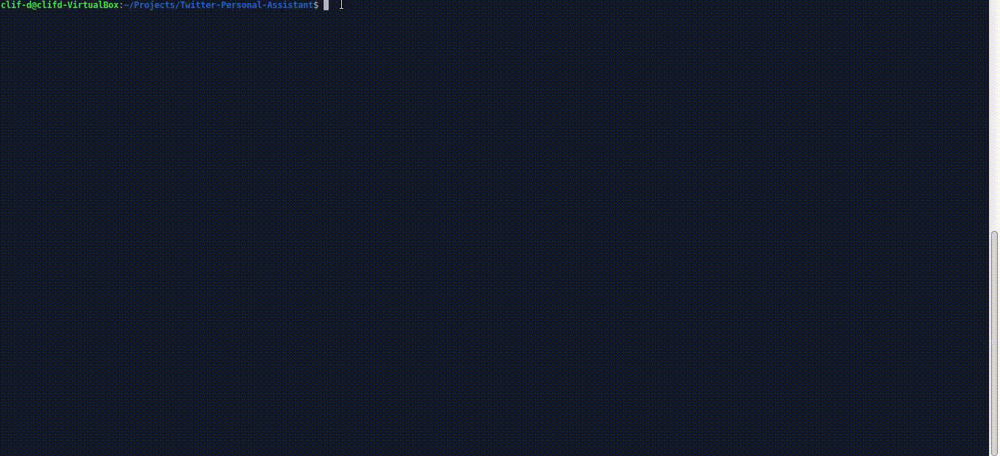

[](https://lbesson.mit-license.org/)
[](http://makeapullrequest.com)
[](https://github.com/ellerbrock/open-source-badges/)


# Twitter Personal Assistant

> Enter the Twitter Personal Assistant (TPA)!
TPA is a CLI for developers who wish to access their Twitter account from the terminal. It enables you to tweet, like mentions and see a summary of your favorite account stats, all from the comfort of your terminal!



## Functionality

Once TPA is up and running, it can:

- Post a tweet
- Like new mentions of you
- Check for
  - tweets you made directly on Twitter, after your first tweet from the command line.
  - new tweets or replies which mention you.
- Store a local record of
  - your tweets since setup, excluding retweets.
  - your mentions since setup.
- Update local record of
  - your tweets to reflect current state of tweets (Example: deletions, new likes and retweets, etc).
  - your mentions, to reflect mentions in their current state.
- Count
  - total followers you have.
  - the number of times you have tweeted.
  - retweets received since your first tweet from terminal.
  - likes received since your first tweet from terminal.
  - number of mentions you liked since setup.
- Display a summary of your account

## :rocket: Getting Started

### Prerequisites

- Ruby
- Twitter Account

### Dependencies

- Dotenv
- Twitter
- YAML

### Setup

1. [Sign up](https://twitter.com/) for a personal twitter account if you don't have one. Apply for a developer account using your personal account [here](https://developer.twitter.com/). Once approved, follow the instructions to create an app and generate its credentials. You'll need the credentials to successfully run or test this version of the app.
2. [Install Ruby](https://www.ruby-lang.org/en/documentation/installation/)
3. Clone repo into your local environment using your favourite terminal:
```
git clone [this-repo-url].git
```
4. Open project directory
```
cd directory-name
```
5. Bulk install dependencies
```
bundle install
```
6. Add `.env` to your gitignore file, then create a .env file. Copy the template below to your .env file, and fill in your app credentials generated from twitter.
**NOTE:** This step is important to ensure your credentials remain protected and confidential.
```ruby
export API_KEY=YOUR_API_KEY
export API_KEY_SECRET=YOUR_API_KEY_SECRET
export ACCESS_TOKEN=YOUR_ACCESS_TOKEN
export ACCESS_TOKEN_SECRET=YOUR_ACCESS_TOKEN_SECRET
```
7. All set! Now start your TPA app
```
bin/main.rb
```
- Congrats! You're in :tada:

## Limitations and Further Work

The Twitter API limits the number of tweets that can be retrieved from a user's timeline to the twenty most recent tweets. To accomodate this TPA starts to keep track of your Twitter activity only after you set it up. Aside from total followers and tweets, all prior activity is ignored. Some future work may include:

- Tweets with media content
- More robust storage of tweets and mentions, instead of locally updated .yml files
- Store all user tweets and mentions before TPA setup
- Deployment to Heroku for persistence
- Integrated authentication system to get user credentials automatically

## :toolbox: Tools & Technologies Used

- Ruby
- RSpec

## Author

👤 **Clifton Davies**

- Github: [@githubhandle](https://github.com/cliftondavies)
- Twitter: [@twitterhandle](https://twitter.com/cliftonaedavies)
- Linkedin: [linkedin](https://www.linkedin.com/in/clifton-davies-mbcs/)

## 🤝 Contributing

Contributions, issues and feature requests are welcome!

1. Fork it
2. Create feature branch
`git checkout -b feature/fooBar`
3. Commit changes
`git commit -am 'Add some fooBar'`
4. Push to the branch
`git push origin feature/fooBar`
5. Create new Pull Request

## Show your support

Give a ⭐️ if you like this project!

## Acknowledgments

- The Corgis!
- Twitter

## 📝 Copyright & License

Copyright (c) 2020 Clifton Davies.
This project is licensed under [MIT](https://opensource.org/licenses/MIT). See LICENSE file for details.
